# ft_irc Study Guide

This guide describes the current workspace as inspected on 2026-09-12. The source files are the authority. The guide does not assume features that are not implemented.

## Pass 1: Project Structure

### Files

| File | Responsibility |
|---|---|
| `src/main.cpp` | Program entry point, argument validation, signal registration, `Server` construction, and `run()`. |
| `include/Server.hpp`, `src/Server.cpp` | Listening socket, client sockets, `poll()`, accepting clients, receiving data, command validation/dispatch, channel/client lookup, shutdown signal. |
| `include/Client.hpp`, `src/Client.cpp` | One connected client: socket fd, registration fields, receive buffer, send buffer, message extraction, outgoing transmission. |
| `include/Channel.hpp`, `src/Channel.cpp` | Channel state: members, operators, invitations, topic, key, user limit, modes, broadcast. |
| `include/Parser.hpp`, `src/Parser.cpp` | Stateless string parsing and utility validation. |
| `include/Commands.hpp`, `src/Commands.cpp` | Command handlers for registration and channel/user IRC commands. |
| `include/Reply.hpp` | Header-only static numeric reply builders. There is deliberately no `Reply.cpp`. |
| `Makefile` | C++98 build with `-Wall -Wextra -Werror`. |

### Dependency overview

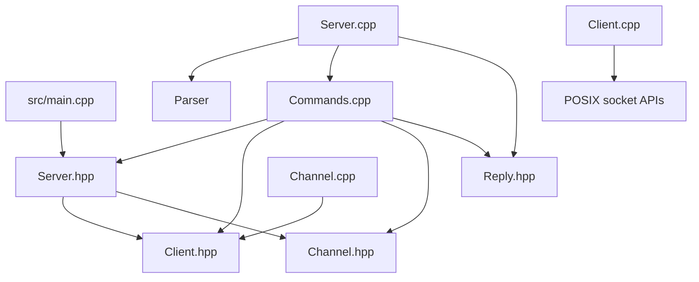

The ownership model is simple: `Server` owns `Client` and `Channel` objects in maps. `Channel` stores non-owning `Client *` pointers into the server's client map. `Parser`, `Commands`, and `Reply` do not own clients or channels.

## Pass 2: Every Function

## `main.cpp`

### `main(int ac, char **av)`

- **Purpose:** Starts the process and validates `./ircserv <port> <password>`.
- **Calls:** `strtol`, `signal`, `Server::Server`, `Server::run`; catches `std::exception`.
- **Parameters:** `ac` is argument count; `av` contains arguments.
- **Return:** `0` on normal shutdown; `1` on validation or server exceptions.
- **State:** Registers `handleSignal`; creates the server.
- **Flow:** checks exactly three arguments, parses a port from 1 to 65535, rejects an empty password, installs SIGINT handling, then enters the server loop.
- **Evaluator question:** Why validate before constructing the server? Because socket setup should not begin with invalid configuration.

### `handleSignal(int signal)` in `Server.cpp`

- **Purpose:** Requests clean shutdown after SIGINT.
- **State:** Writes a short message with `write()` and sets global `volatile sig_atomic_t g_running` to zero.
- **Why `sig_atomic_t`:** It is the type intended for safe simple access from a signal handler.
- **Important limitation:** The handler only changes the flag and writes; complex C++ operations are intentionally avoided.

## `Server.cpp`

### Static `isSupportedCommand(const std::string &command)`

Checks the command against the fixed list: `CAP`, `PING`, `PONG`, `QUIT`, `PASS`, `NICK`, `USER`, `INVITE`, `JOIN`, `KICK`, `MODE`, `PART`, `PRIVMSG`, and `TOPIC`. It returns `true` on a match. The current loop uses the literal count `14`; adding a command requires updating both the array and count.

### Static `isRegistrationCommand(const std::string &command)`

Returns whether a command is allowed before registration: `PASS`, `NICK`, `USER`, `CAP`, `PING`, `PONG`, or `QUIT`. It does not validate parameters; it only controls the registration gate.

### `Server::Server(int port, const std::string &password)`

Creates the TCP listening socket, enables `SO_REUSEADDR`, sets the listening fd non-blocking, fills `sockaddr_in`, binds to all local interfaces, listens with backlog 10, prints the port, and inserts the listening fd as poll slot zero. On setup failure it closes the socket and throws.

The listening fd is special: readable means a new connection is waiting, not IRC data.

### `Server::~Server()`

Closes every client fd and the listening fd. It does not manually clear maps because destruction is already ending object lifetime.

### `Server::run()`

Repeats while `g_running` is nonzero. It blocks in `poll()` with an infinite timeout. If SIGINT interrupts `poll()`, the flag is zero and the loop breaks. Otherwise a poll failure throws. Each active vector index is passed to `processPollEvent()`.

### `Server::processPollEvent(size_t &index)`

Coordinates handling for one poll slot. It first delegates error/hangup flags to `handlePollError()`, then delegates the listening socket to `handleServerSocket()`. For client slots it calls `receiveMessage()` for `POLLIN` and `handleClientOutput()` for `POLLOUT`. It receives `index` by reference because removing a poll entry requires decrementing the loop index so the next vector entry is not skipped.

### `Server::handlePollError(size_t &index)`

Checks `POLLHUP`, `POLLERR`, and `POLLNVAL`. For a client slot it calls `handleDisconnect()` and decrements the index after the vector entry is erased. For slot zero it stops processing that event without attempting to accept. It returns `true` when an error/hangup condition was handled and `false` otherwise.

### `Server::handleServerSocket(size_t index)`

Checks whether the current poll slot is slot zero, which represents the listening socket. If that slot has `POLLIN`, it calls `acceptClient()`. It returns `true` for the listening slot so the caller does not treat it like a client socket, and `false` for client slots.

### `Server::handleClientOutput(size_t index)`

Looks up the client belonging to the poll slot, calls `sendPendingData()`, and removes `POLLOUT` from the requested event mask once the client's send buffer is empty. This keeps output flushing separate from input and disconnect handling.

### `Server::acceptClient()`

Calls `accept()` on the listening socket, makes the new fd non-blocking, creates a `pollfd`, appends it to `_pollFds`, and inserts `Client(clientFd)` into `_clients`. It logs the fd. A failed non-blocking `accept()` simply returns.

### `Server::receiveMessage(size_t index)`

Finds the `Client` belonging to the poll fd, calls `recv()` into a 511-byte temporary buffer, appends the received bytes to the client's persistent receive buffer, and repeatedly extracts complete CRLF-delimited messages. Each complete message goes to `handleMessage()`.

Return value: `true` means the caller's poll entry was removed or the client disappeared; `false` means continue normally. `recv() == 0` means peer orderly shutdown and calls `handleDisconnect()`.

### `Server::handleDisconnect(size_t index)`

Removes the client from every channel, erases empty channels, erases the client from `_clients`, closes the fd, removes its poll entry, and logs disconnection. Channel member pointers are safe only while their `Client` remains in `_clients`, so removal happens before client erasure.

### `Server::handleMessage(Client &, const std::string &)`

Parses one complete IRC line, uppercases the command token, separates params, rejects unsupported commands with `421`, rejects known non-registration commands from unregistered clients with `451`, calls `dispatchCommand()`, then enables `POLLOUT` for every client with queued data.

This function is the main application boundary: raw complete line in, parsed command behavior out.

### `Server::dispatchCommand(Client &, const std::string &, const vector<string> &)`

Routes commands. `CAP`, `PING`, `PONG`, and `QUIT` are handled in this function. Registration and channel/user commands are delegated to the free functions in `Commands.cpp`. It returns `false` for `QUIT` because the client was removed; normal commands return `true`.

### `Server::enableWrite(Client &)`

Finds the client's poll slot and adds `POLLOUT` to its event mask. It is called after data is queued so `poll()` wakes when the socket can accept outgoing bytes.

### `Server::getChannel`, `createChannel`, `removeChannel`

`getChannel` linearly searches `_channels` by channel name. `createChannel` assigns a monotonically increasing integer ID from `_nextChannelId`, inserts the new channel, and returns it. The counter must not be replaced with `_channels.size()`: after a channel is erased, the size can reuse an existing key, and `std::map::insert()` would keep the old channel instead of creating the requested one. `removeChannel` erases the first channel with a matching name.

### `Server::getClientByNick`

Linearly searches `_clients` by nickname and returns a pointer to the stored `Client`, or `NULL`.

## `Client.cpp`

### Constructor/destructor and `getFd()`

The constructor stores the socket fd and initializes `_passOk` and `_registered` to false. The destructor has no custom work. `getFd()` returns the operating-system descriptor.

### `appendToBuffer(const char *, size_t)`

Appends exactly `size` bytes to `_receiveBuffer`. It does not assume the bytes form a complete IRC command.

### `hasCompleteMessage()`

Returns whether `_receiveBuffer` contains `"\r\n"`.

### `getNextMessage()`

Finds the first CRLF. If absent, returns an empty string without changing the buffer. If present, returns the bytes before CRLF and erases that message plus the two delimiter bytes. This supports both fragmented input and multiple messages in one receive buffer.

### `sendMessage(const std::string &)`

Appends data to `_sendBuffer`; it does not call `send()` immediately. This prevents partial writes from losing unsent data.

### `hasPendingData()`

Returns whether `_sendBuffer` is non-empty.

### `sendPendingData()`

Calls `send()` once for the queued buffer and erases the number of bytes reported as sent. If only part of the buffer is sent, the remainder stays queued. Current limitation: send errors and `EAGAIN` are not explicitly handled.

### `getPrefix()`

Builds `nickname!username@localhost` dynamically. `_prefix` exists as a member but is not used by this implementation.

### Getters/setters

The nickname, username, real name, PASS state, and registered state accessors expose or mutate the client's registration state. The nickname and username are used in prefixes and reply targets.

## `Channel.cpp`

### Constructors/destructor

The normal constructor initializes a named channel with no key, invite-only mode, topic restriction, or limit. The second constructor initializes a keyed channel, although the current JOIN path creates channels with the first constructor. The destructor has no custom work.

### State getters and `getModesString()`

Getters expose name, topic, key, limit, member/operator lists, and booleans. `getModesString()` builds a mode string beginning with `+`, then adds `i`, `t`, `k`, and `l` for active modes.

### Mode/topic mutators

`setTopic`, `setKey`, `removeKey`, `setLimit`, `removeLimit`, `setInviteOnly`, and `setTopicRestricted` change channel state and corresponding flags.

### Membership/operator methods

`addMember` avoids null and duplicates. `removeMember` erases the member and also removes operator status. `isMember` supports pointer or nickname lookup. `addOperator` avoids null and duplicates; `removeOperator` erases one pointer; `isOperator` searches the operator list.

### Invitation methods

`addInvite`, `removeInvite`, and `isInvited` manage nickname strings in `_invitedNicknames`.

### `broadcast(const std::string &, Client *sender)`

Queues the message for every member except the optional sender. `broadcast(message)` includes everyone because the default sender is `NULL`; `broadcast(message, &client)` excludes that client. JOIN, KICK, MODE, PART, and TOPIC use the inclusive form; channel PRIVMSG excludes the sender.

### `getNamesString()`

Builds space-separated names. Operators receive an `@` marker.

## `Parser.cpp`

### `parseMessage(const std::string &)`

Removes trailing CR/LF, optionally skips an input prefix beginning with `:`, skips spaces, emits normal space-delimited tokens, and treats `:` as the start of a trailing parameter whose remaining text is one token. Example:

```text
PRIVMSG #general :hello how are you
=> PRIVMSG | #general | hello how are you
```

The server normally removes CRLF before calling this, but the parser also defensively strips it.

### `splitByComma(const std::string &)`

Splits comma-separated values and skips empty pieces. It is documented for JOIN multiple channels but the current `handleJoin()` does not call it.

### `stringToInt(const std::string &, int &)`

Uses `strtol`, rejects empty strings and trailing non-numeric text, writes the parsed integer, and returns success. The current command code does not use it for MODE `+l`; MODE currently uses `std::atoi`.

### `isValidNickname(const std::string &)`

Checks non-empty, maximum length nine, alphabetic first character, and allowed later characters. The current `Commands.cpp` uses its own local `isValidNick()` instead, so this Parser method is currently unused.

## `Commands.cpp` command handlers

All handlers receive the `Server`, the requesting `Client`, and parsed parameters. They queue replies through `client.sendMessage()` and broadcasts through `Channel::broadcast()`.

### `handlePass`

Rejects PASS after registration, checks a parameter, compares it to the server password, sets `_passOk`, and registers/sends welcome if nickname and username are already present. Wrong password returns `464`; missing parameter returns `461`.

### `handleNick`

Requires a parameter, validates it with the local `isValidNick`, rejects duplicates using `getClientByNick`, stores the nickname, sends a NICK message if already registered, or completes registration if PASS and USER are already available. Invalid nick returns `432`; duplicate returns `433`.

### `handleUser`

Rejects USER after registration, requires four parameters, stores username and the fourth parameter as real name, and completes registration if PASS and nickname are present. It sends `461` for too few parameters and `001` when registration completes.

### `handleJoin`

Requires a channel parameter beginning with `#`. It looks up or creates the channel, checks key, limit, and invite-only restrictions for existing channels, adds the client, makes the creator operator, removes any invitation, broadcasts JOIN, and sends topic/names numerics. Empty channels are created by the first JOIN.

### `handlePart`

Requires an existing channel and membership, broadcasts PART, removes the client, and removes the channel if empty.

### `handlePrivmsg`

Requires target and text. For `#channel`, it checks existence and membership then broadcasts to everyone except sender. For a nickname, it finds the target and queues a direct prefixed message. Missing targets produce `403` or `401`/the project's chosen text.

### `handleKick`

Requires channel and target, checks channel existence, requester membership, and operator status, then requires the target to be a channel member. It broadcasts KICK, removes the target, and deletes the channel if empty.

### `handleInvite`

Requires target nickname and channel. It checks the target nickname first, then channel existence, target membership, requester membership, and invite-only operator permission. It stores the target nickname in the invitation set, sends `341` to the inviter, and sends an INVITE notice to the target.

### `handleTopic`

Requires an existing channel and membership. With only a channel it reports the current topic; with a second parameter it checks topic restriction/operator permission, changes the topic, and broadcasts TOPIC.

### `handleMode`

Requires a channel, reports modes when no mode string is supplied, and otherwise requires operator status. It walks `+`/`-` mode state and handles `i`, `t`, `k`, `l`, and `o`. Parameters for key, limit, and operator target are consumed in order. It then broadcasts the original mode string and parameters. Current limitations include weak validation of unknown modes and `atoi` conversion for limits.

## Pass 3: Actual Server Flow

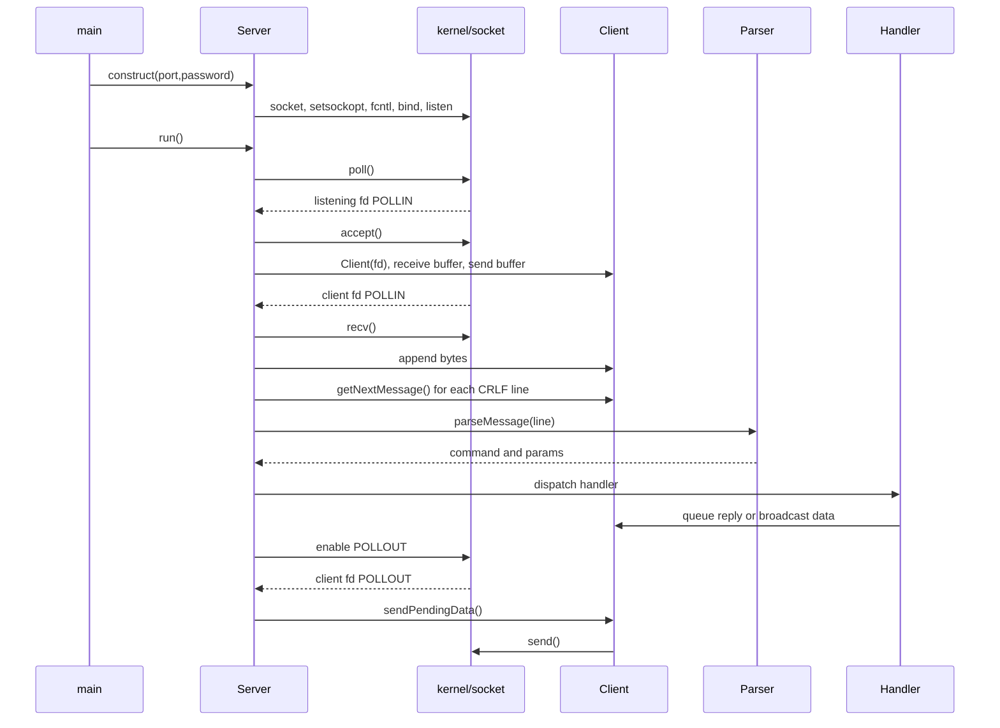

Startup is `main -> Server constructor -> run -> poll`. For each ready slot, `processPollEvent()` routes errors to `handlePollError()`, slot zero to `handleServerSocket()`, client input to `receiveMessage()`, and client output to `handleClientOutput()`. The server socket occupies `_pollFds[0]`; client sockets occupy later slots. A client is inserted into `_clients` immediately after accept, before it registers. Registration is application state, not socket state.

If TCP sends `com`, then `man`, then `d\r\n`, the receive buffer becomes:

```text
recv 1: "com"       buffer = "com"       no parse
recv 2: "man"       buffer = "comman"    no parse
recv 3: "d\r\n"     buffer = "command\r\n" complete
extract:             message = "command", buffer = ""
```

If one recv contains `NICK rasha\r\nUSER ...\r\n`, the while loop extracts and handles both messages. If a client disconnects with `recv() == 0`, `handleDisconnect()` removes memberships and closes the fd. QUIT calls the same cleanup path from command dispatch. SIGINT sets `g_running = 0`; an interrupted poll returns, the loop exits, and the Server destructor closes sockets.

## Pass 4: TCP, poll, and buffering

TCP is a byte stream, not a message protocol. It can split one send across receives or combine several sends into one receive. IRC uses CRLF as the application-level message delimiter, so `Client::_receiveBuffer` preserves bytes until CRLF appears.

`POLLIN` means a descriptor can be read without blocking. For the listening socket it means accept a new connection. For a client socket it means call `recv()`. `POLLOUT` means the socket can accept outgoing bytes. The program queues outgoing data because `send()` may write only part of a message. POLLOUT is enabled only after something is queued, avoiding a loop that constantly reports writable sockets.

Current implementation detail: `recv()` uses a 512-byte local array but receives at most 511 bytes to reserve a null terminator. The data is still appended with an explicit byte count, so embedded nulls are not needed for IRC text. There is no explicit maximum receive-buffer or IRC 512-byte line enforcement in the current code.

## Pass 5: Registration

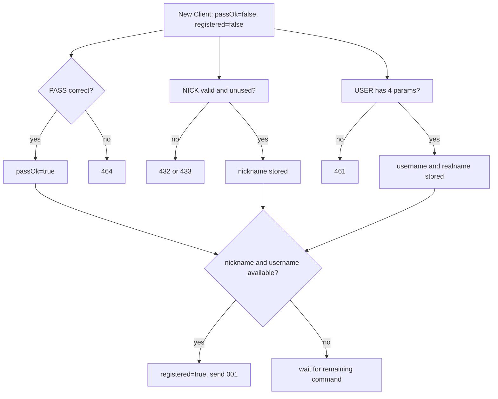

The commands may arrive in any order. Each handler stores its piece and checks whether all required state is now available. The server considers the client registered only when `_passOk`, a non-empty nickname, and a non-empty username are all true. A known command requiring registration before that point receives `451`; an unsupported command receives `421` first.

## Pass 6: Command map

| Command | Dispatch/handler | Main effect |
|---|---|---|
| PASS | `handlePass` | Validate password, set pass state. |
| NICK | `handleNick` | Validate/store nickname, possibly register. |
| USER | `handleUser` | Store user/real name, possibly register. |
| JOIN | `handleJoin` | Create/find channel, add member/operator, send numerics. |
| PART | `handlePart` | Broadcast departure and remove membership. |
| PRIVMSG | `handlePrivmsg` | Direct message or channel broadcast excluding sender. |
| KICK | `handleKick` | Operator removes member and broadcasts. |
| INVITE | `handleInvite` | Record invitation and notify target. |
| TOPIC | `handleTopic` | Read/change topic with restriction checks. |
| MODE | `handleMode` | Read/change channel modes. |
| PING | `dispatchCommand` | Queue `PONG`. |
| PONG | `dispatchCommand` | No action. |
| QUIT | `dispatchCommand` | Remove client. |
| CAP | `dispatchCommand` | Minimal LS/REQ responses. |

Example `PRIVMSG #test :hello everyone` becomes tokens `[PRIVMSG,#test,hello everyone]`, is allowed only after registration, finds `#test`, verifies membership, constructs `:nick!user@localhost PRIVMSG #test :hello everyone\r\n`, queues it for all other members, and later sends it through POLLOUT.

`PRIVMSG Rasha :hello` instead finds a client by nickname and queues the message only for that client. `MODE #test +o user` consumes `user` as the `o` parameter and changes operator state if that client is a member.

## Pass 7: Client and Channel relationship

`Server::_clients` is a map from fd to `Client`. `Server::_channels` is a map from an internal integer id to `Channel`. A Channel stores raw `Client *` pointers; Server remains the owner. Therefore disconnect cleanup must remove a client from channels before erasing it from `_clients`.

- JOIN: `addMember`; first creator also `addOperator`.
- PART: broadcast, `removeMember`; `removeMember` also removes operator status; delete empty channel.
- KICK: broadcast, remove target; delete empty channel.
- QUIT/disconnect: remove client from every channel; delete channels that become empty.
- INVITE: add nickname to `_invitedNicknames`; JOIN later removes that invitation.

## Pass 8: Numeric replies

All current numeric builders in `Reply.hpp` use the fixed prefix `:ft_irc` and append CRLF. RPL means a positive informational reply; ERR means an error. Normal IRC messages such as JOIN, PRIVMSG, MODE, and INVITE are not numeric replies and generally use a client prefix such as `:rasha!rasha@localhost`.

| Code | Function | Meaning/current use |
|---:|---|---|
| 001 | `RPL_WELCOME` | Registration completed. |
| 324 | `RPL_CHANNELMODEIS` | Reports channel modes. |
| 331 | `RPL_NOTOPIC` | Channel has no topic. |
| 332 | `RPL_TOPIC` | Reports channel topic. |
| 341 | `RPL_INVITING` | Invitation accepted. |
| 353 | `RPL_NAMREPLY` | Channel member list. |
| 366 | `RPL_ENDOFNAMES` | End of names list. |
| 401 | `ERR_NOSUCHNICK` | Target nickname not found. |
| 403 | `ERR_NOSUCHCHANNEL` | Channel not found/invalid in relevant command. |
| 404 | `ERR_CANNOTSENDTOCHAN` | Cannot send to channel. |
| 421 | `ERR_UNKNOWNCOMMAND` | Command is not in supported list. |
| 431 | `ERR_NONICKNAMEGIVEN` | NICK had no parameter. |
| 432 | `ERR_ERRONEUSNICKNAME` | Nickname format invalid. |
| 433 | `ERR_NICKNAMEINUSE` | Nickname already used. |
| 441 | `ERR_USERNOTINCHANNEL` | KICK target is not a member. |
| 442 | `ERR_NOTONCHANNEL` | Requester is not a member. |
| 443 | `ERR_USERONCHANNEL` | Invite target already belongs. |
| 451 | `ERR_NOTREGISTERED` | Known command used before registration. |
| 461 | `ERR_NEEDMOREPARAMS` | Required parameters missing. |
| 462 | `ERR_ALREADYREGISTRED` | Registration command after registration. |
| 464 | `ERR_PASSWDMISMATCH` | Wrong password. |
| 471 | `ERR_CHANNELISFULL` | Channel user limit reached. |
| 473 | `ERR_INVITEONLYCHAN` | Invite-only channel without invitation. |
| 475 | `ERR_BADCHANNELKEY` | Wrong channel key. |
| 482 | `ERR_CHANOPRIVSNEEDED` | Operator permission required. |

A numeric has a server prefix because the client needs to know which server generated it: `:ft_irc 421 nickname COMMAND :Unknown command`. The prefix is not the same as the target client's user prefix.

## Pass 9: Signals and cleanup

`signal(SIGINT, handleSignal)` installs the handler. `g_running` is global because the handler must communicate with the loop without a Server object. It is `volatile sig_atomic_t` so a signal interruption can safely change/read the simple flag. SIGINT writes `Shutting down ...` with `write()` and sets the flag to zero. `poll()` is interrupted; `run()` sees the flag and exits instead of throwing. Stack unwinding then invokes `Server::~Server()`, which closes client and listening descriptors.

The handler does not directly close sockets or call C++ stream operations. That is important because most C++ and allocation operations are not signal-handler-safe.

## Pass 10: Evaluator preparation

### Beginner questions

- **What does `main` do?** Validates arguments, installs SIGINT, constructs Server, and calls `run()`.
- **Why C++98 flags?** The Makefile explicitly compiles with `-std=c++98`.
- **What is a Client?** State and buffers associated with one connected socket.
- **What is a Channel?** Shared IRC state and a list of non-owning client pointers.
- **When is a client registered?** After correct PASS, nickname, and username are all present.
- **What does `broadcast` do?** Queues a message to members, optionally excluding the sender.

### Intermediate questions

- **Why is slot zero special?** It is the listening fd; POLLIN means `accept`, not `recv`.
- **Why does `recv()` append to a buffer?** TCP can split or combine IRC lines.
- **Why does `sendMessage()` not call `send()`?** It queues output so partial writes are preserved.
- **Why check nickname before channel in INVITE?** The current handler follows the expected target-nick-first behavior.
- **Why does QUIT return false from dispatch?** The Client and poll entry have been removed, so normal post-dispatch handling must stop.
- **How are empty channels removed?** PART, KICK, and disconnect cleanup erase them after member count reaches zero.

### Deep questions

- **What if `send()` writes only part of a reply?** The sent prefix is erased and the remainder stays in `_sendBuffer`; error handling is currently minimal.
- **What if two messages arrive in one recv?** The receive buffer's while loop extracts each CRLF-delimited message.
- **What if one message is fragmented?** It remains in `_receiveBuffer` until CRLF appears.
- **Why non-blocking sockets?** A single slow client should not make the event loop block on accept, recv, or send.
- **Why POLLOUT only when needed?** A socket is usually writable; always polling POLLOUT would wake continuously and waste CPU.
- **How does signal shutdown work?** SIGINT changes the atomic flag, interrupts poll, run exits, and the destructor closes descriptors.
- **What are the main limitations?** No explicit IRC 512-byte line cap, no channel-name length cap, `MODE +l` uses `atoi`, several parser helpers are unused, and send error handling is not detailed.

## Visual maps

### High-level architecture

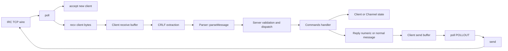

### Class relationships

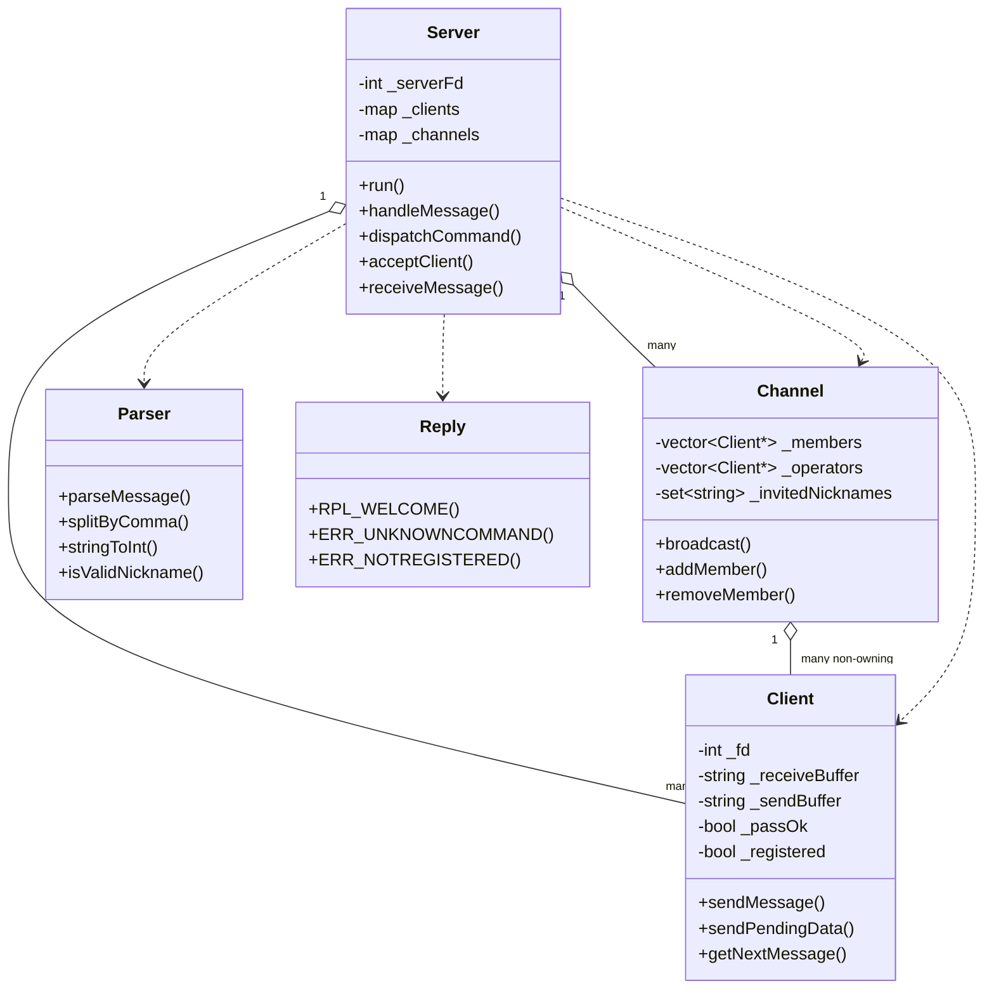

### Lifecycle

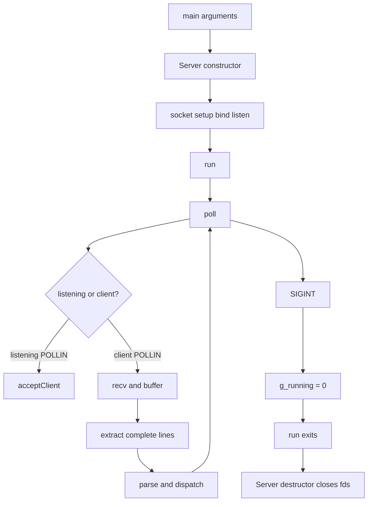

### Registration

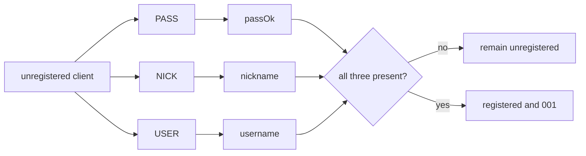

### Channel PRIVMSG

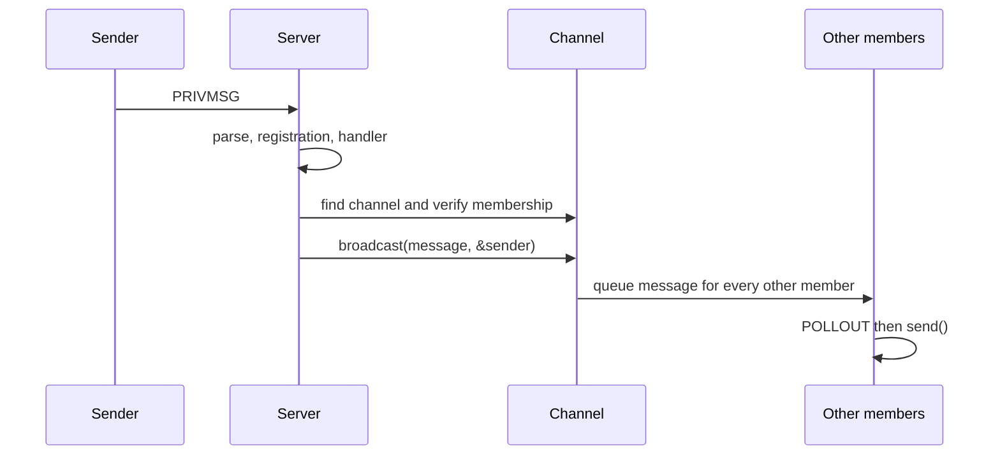

### Fragmented TCP example

```text
recv("com")       -> receiveBuffer = "com"
recv("man")       -> receiveBuffer = "comman"
recv("d\r\n")     -> receiveBuffer = "command\r\n"
find CRLF          -> parser receives "command"
remaining buffer   -> ""
```

### Command dispatch

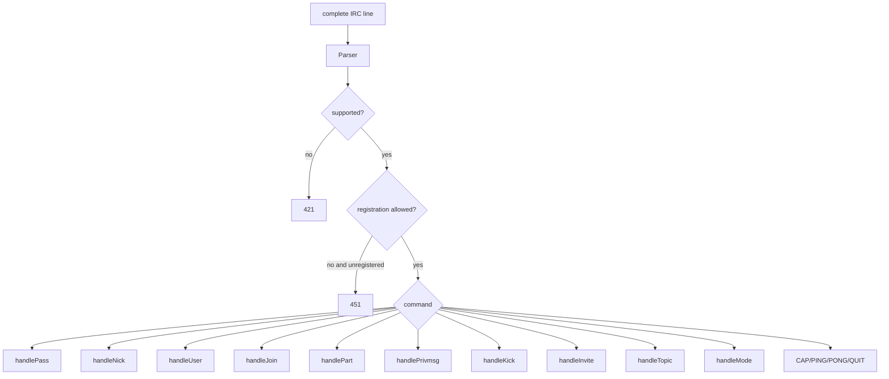

### Disconnect and QUIT

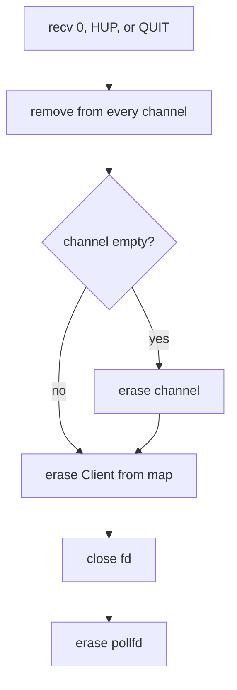

### SIGINT

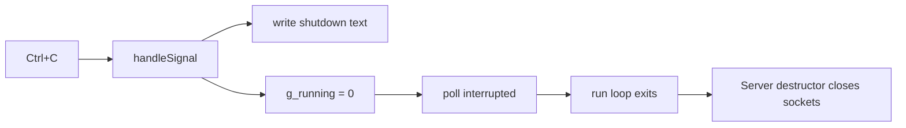

## Compact cheat sheet

```text
main
  validates port/password, installs SIGINT
Server
  owns pollfds, Client objects, Channel objects
poll slot 0
  listening socket; POLLIN means accept
  client slots
  POLLIN -> receiveMessage; POLLOUT -> handleClientOutput -> sendPendingData
Client receive buffer
  stores bytes until CRLF; extracts one or many IRC lines
Parser
  command + normal parameters + one trailing parameter
Server validation
  unknown => 421; known but unregistered => 451
Commands
  mutate registration, Client state, Channel state, or queue messages
Channel
  members, operators, invitations, topic, modes, broadcast
Reply
  header-only numeric strings beginning :ft_irc
shutdown
  SIGINT -> g_running=0 -> poll exits -> destructor closes fds
```

## Current-code caveats to know before evaluation

1. The README run example is incomplete; the actual program requires `./ircserv <port> <password>`.
2. `Parser::splitByComma`, `Parser::stringToInt`, and `Parser::isValidNickname` are currently not used by the command path.
3. `Commands.cpp` has its own nickname validator, so there are two validation implementations.
4. There are no explicit channel-name, message-length, or receive-buffer limits corresponding to IRC's 512-byte line convention.
5. `sendPendingData()` keeps partial writes but does not explicitly report or recover from all send errors.
6. The current code uses fixed `:ft_irc` in replies; there is no configurable server-name field.
7. `RPL_WELCOME` includes the client's generated prefix after the welcome text, matching the current implementation but worth explaining if an evaluator asks about the exact output.
8. Channel map IDs are deliberately monotonic. Using `_channels.size()` would allow ID collisions after channel deletion and could cause `std::map::insert()` to return the existing channel under the wrong requested name.
